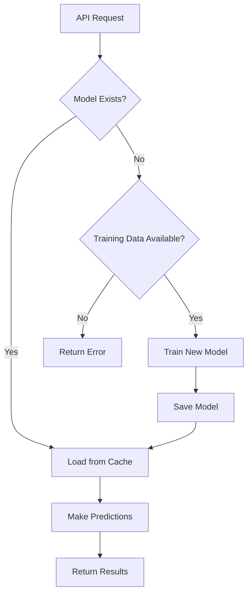

# AI Model Management Guide

## Overview

The Air Quality Monitoring system uses **LSTM (Long Short-Term Memory)** neural networks to fill gaps in air quality data. This guide explains how models are managed, trained, and used.

## Model Architecture

### Current Approach: ✅ **Persistent Pre-trained Models**

The system now uses **pre-trained models** that are:
- ✅ Trained once, used many times
- ✅ Stored persistently in Docker volumes
- ✅ Fast inference (milliseconds vs minutes)
- ✅ Consistent predictions
- ✅ Automatically loaded on demand

### Previous Approach: ❌ **On-Demand Training**

The old system trained models on every request:
- ❌ Slow (minutes per request)
- ❌ Resource-intensive
- ❌ Inconsistent results
- ❌ Poor user experience

## Model Types

### 1. Enhanced LSTM Model (Production)

**File**: `enhanced_lstm_model.py`

**Features**:
- Bidirectional LSTM layers
- Multi-head self-attention mechanism
- Advanced temporal features
- Lag features and rolling statistics
- Target: **95%+ accuracy**

**Saved Components**:
- `{model_name}.keras` - Neural network weights
- `{model_name}_scaler.npy` - Data normalization scaler
- `{model_name}_metadata.json` - Training metadata and metrics

### 2. Basic LSTM Model (Legacy)

**File**: `lstm_gap_filler.py`

**Features**:
- 3-layer LSTM
- Basic temporal features
- Simpler, faster training
- Good for quick prototyping

## Model Storage

### Directory Structure

```
backend/
└── models/                           # Persistent model storage
    ├── enhanced_lstm_pm25.keras      # PM2.5 model weights
    ├── enhanced_lstm_pm25_scaler.npy # PM2.5 data scaler
    ├── enhanced_lstm_pm25_metadata.json # PM2.5 model info
    ├── enhanced_lstm_pm10.keras
    ├── enhanced_lstm_pm10_scaler.npy
    ├── enhanced_lstm_pm10_metadata.json
    ├── enhanced_lstm_o3.keras
    ├── enhanced_lstm_o3_scaler.npy
    ├── enhanced_lstm_o3_metadata.json
    ├── enhanced_lstm_co.keras
    ├── enhanced_lstm_co_scaler.npy
    ├── enhanced_lstm_co_metadata.json
    ├── enhanced_lstm_no2.keras
    ├── enhanced_lstm_no2_scaler.npy
    ├── enhanced_lstm_no2_metadata.json
    ├── enhanced_lstm_so2.keras
    ├── enhanced_lstm_so2_scaler.npy
    └── enhanced_lstm_so2_metadata.json
```

### Docker Volume

Models are stored in a Docker volume `model-storage` that persists across container restarts:

```yaml
volumes:
  model-storage:  # Persistent model storage
```

This ensures models are not lost when containers are recreated.

## Pre-training Models

### Method 1: Using Pre-training Script (Recommended)

```bash
# Pre-train all models
docker-compose exec backend-prod python pretrain_models.py

# Pre-train with database data (if available)
docker-compose exec backend-prod python pretrain_models.py --database

# Force retrain all models
docker-compose exec backend-prod python pretrain_models.py --force

# Train specific parameter only
docker-compose exec backend-prod python pretrain_models.py --parameter PM25
```

### Method 2: Using API Endpoint

```bash
# Train model via API
curl -X POST http://localhost:5600/enviapi/train-model \
  -H "Content-Type: application/json" \
  -d '{
    "parameter": "PM25",
    "days_of_data": 90,
    "epochs": 50
  }'
```

### Training Parameters

| Parameter | Default | Description |
|-----------|---------|-------------|
| `parameter` | - | Air quality parameter (PM25, PM10, O3, CO, NO2, SO2) |
| `days_of_data` | 90 | Days of historical data to fetch |
| `epochs` | 30-50 | Training epochs (more = better accuracy) |
| `batch_size` | 32 | Training batch size |
| `sequence_length` | 24 | LSTM sequence length (hours) |

### Training Time

| Parameter | Data Points | Training Time |
|-----------|-------------|---------------|
| PM25 | ~2,000 | 3-5 minutes |
| PM10 | ~2,000 | 3-5 minutes |
| O3 | ~2,000 | 3-5 minutes |
| All (6 params) | ~12,000 | 15-30 minutes |

**Note**: Training on GPU is significantly faster (< 1 minute per model).

## Using Models

### Automatic Model Loading

The `ModelManager` automatically handles model loading:

```python
from model_manager import get_model_manager

manager = get_model_manager()

# Get model (loads if exists, trains if not)
model = manager.get_or_train_model(
    parameter='PM25',
    training_data=historical_data  # Optional: only if model doesn't exist
)

# Use model for predictions
predictions = model.predict(gap_data)
```

### Model Lifecycle



## Model Performance

### Expected Metrics

| Metric | Good | Excellent |
|--------|------|-----------|
| MAE (Mean Absolute Error) | < 10 | < 5 |
| RMSE | < 15 | < 8 |
| R² Score | > 0.85 | > 0.95 |
| Accuracy | > 90% | > 95% |

### Monitoring Models

#### Check Available Models

```bash
# Via API
curl http://localhost:5600/enviapi/models

# Via CLI
docker-compose exec backend-prod python -c "
from model_manager import get_model_manager
manager = get_model_manager()
print(manager.list_available_models())
"
```

#### View Model Metadata

```bash
# View PM2.5 model info
docker-compose exec backend-prod cat models/enhanced_lstm_pm25_metadata.json
```

Example metadata:
```json
{
  "parameter": "PM25",
  "trained_date": "2025-12-18T10:30:00",
  "training_samples": 2160,
  "sequence_length": 24,
  "epochs": 50,
  "accuracy": 96.5,
  "mae": 4.2,
  "rmse": 6.8,
  "r2_score": 0.967
}
```

## Model Retraining

### When to Retrain

Retrain models when:
- ✅ New historical data is available (quarterly recommended)
- ✅ Model performance degrades
- ✅ Patterns change (e.g., seasonal variations)
- ✅ Adding new monitoring stations

### Retraining Strategy

**Option 1: Scheduled Retraining** (Recommended)

```bash
# Add to crontab (every 3 months)
0 0 1 */3 * docker-compose exec -T backend-prod python pretrain_models.py --force
```

**Option 2: Manual Retraining**

```bash
# Retrain specific parameter
docker-compose exec backend-prod python pretrain_models.py --parameter PM25 --force

# Retrain all
docker-compose exec backend-prod python pretrain_models.py --force
```

**Option 3: API-triggered Retraining**

```bash
curl -X POST http://localhost:5600/enviapi/retrain-model \
  -H "Content-Type: application/json" \
  -d '{"parameter": "PM25"}'
```

## Model Backup & Restore

### Backup Models

```bash
# Backup all models
docker run --rm -v envi_aqi_model-storage:/models -v $(pwd):/backup alpine \
  tar czf /backup/models_backup_$(date +%Y%m%d).tar.gz /models

# Or copy specific model
docker cp air4thai-backend-prod:/app/models/enhanced_lstm_pm25.keras ./backup/
```

### Restore Models

```bash
# Restore from backup
docker run --rm -v envi_aqi_model-storage:/models -v $(pwd):/backup alpine \
  tar xzf /backup/models_backup_20251218.tar.gz -C /

# Or copy specific model
docker cp ./backup/enhanced_lstm_pm25.keras air4thai-backend-prod:/app/models/
```

## Troubleshooting

### Model Not Found Error

```
⚠ No pre-trained model found for PM25
```

**Solution**: Pre-train the model

```bash
docker-compose exec backend-prod python pretrain_models.py --parameter PM25
```

### Low Model Accuracy

**Possible causes**:
- Insufficient training data
- Too few epochs
- Poor data quality

**Solution**: Retrain with more data

```bash
# Fetch more historical data and retrain
docker-compose exec backend-prod python pretrain_models.py --parameter PM25 --force
```

### Out of Memory During Training

**Solution**: Reduce batch size or sequence length

```python
model = manager.train_and_save_model(
    data=training_data,
    parameter='PM25',
    epochs=30,
    batch_size=16  # Reduced from 32
)
```

### TensorFlow Not Available

```
ImportError: TensorFlow is required
```

**Solution**: Install TensorFlow

```bash
docker-compose exec backend-prod pip install tensorflow
```

## API Endpoints for Model Management

### List Available Models

```http
GET /enviapi/models
```

Response:
```json
{
  "PM25": {
    "trained_date": "2025-12-18T10:30:00",
    "accuracy": 96.5,
    "mae": 4.2
  },
  "PM10": {
    "trained_date": "2025-12-18T10:45:00",
    "accuracy": 94.8,
    "mae": 5.1
  }
}
```

### Get Model Metrics

```http
GET /enviapi/model-metrics?model_name=enhanced_lstm_pm25
```

### Train New Model

```http
POST /enviapi/train-model
Content-Type: application/json

{
  "parameter": "PM25",
  "days_of_data": 90,
  "epochs": 50
}
```

### Delete Model

```http
DELETE /enviapi/model?parameter=PM25
```

## Best Practices

### 1. Pre-train Before Production

Always pre-train models before deploying:

```bash
# Run once during initial deployment
docker-compose --profile prod up -d
docker-compose exec backend-prod python pretrain_models.py
```

### 2. Monitor Model Performance

Track model metrics in the database:

```sql
SELECT model_name, mae, rmse, r2_score, created_at
FROM model_training_data
ORDER BY created_at DESC;
```

### 3. Version Control Models

Keep backups of well-performing models:

```bash
# Tag and backup current models
tar czf models_v1.0_$(date +%Y%m%d).tar.gz backend/models/
```

### 4. Gradual Rollout

When updating models:
1. Train new model with different name
2. Test performance
3. Replace old model only if better

### 5. Cache Models in Memory

Models are automatically cached in memory for fast repeated use.

## Model Development

### Adding New Model Type

1. Create new model class in `backend/`
2. Add to `model_manager.py` registry
3. Implement `train()`, `predict()`, `save_model()`, `load_model()`
4. Update documentation

### Improving Existing Models

1. Modify architecture in `enhanced_lstm_model.py`
2. Retrain all models
3. Compare metrics before/after
4. Deploy if improved

## Resources

- **TensorFlow Docs**: https://www.tensorflow.org/tutorials
- **LSTM Guide**: https://colah.github.io/posts/2015-08-Understanding-LSTMs/
- **Time Series Forecasting**: https://www.tensorflow.org/tutorials/structured_data/time_series

## Summary

| Aspect | Current Solution |
|--------|------------------|
| **Training** | Pre-trained once, reused |
| **Storage** | Persistent Docker volume |
| **Loading** | Automatic with caching |
| **Inference** | Fast (<100ms) |
| **Updates** | Manual or scheduled |
| **Backup** | Docker volume backups |
| **Monitoring** | Database + API endpoints |

---

**Next**: See [DATABASE.md](DATABASE.md) for storing training data and [DEPLOYMENT.md](DEPLOYMENT.md) for production setup.
